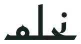

  <picture>
    <source media="(prefers-color-scheme: dark)" srcset="assets/nahlam-wordmark-dark.svg">
    
  </picture>

  An open civic movement in formation
   
  حركة مدنية مفتوحة المصدر، قيد التأسيس

---

Nahlam is an early proposal for an open civic movement through which Syrians can help shape how homes and cities are rebuilt.

Plans, decisions, budgets, selection processes, contracts, and progress should be documented publicly. The process is open. Personal information is not.

Nahlam is at the beginning. It is currently one person’s proposal — there is no project, funding, government agreement, or announced partnership. The first task is to explain the idea clearly and invite others to examine it.

«نحلم» مقترح أولي لحركة مدنية مفتوحة المصدر، تتيح للسوريين المشاركة في رسم ملامح إعادة بناء بيوتهم ومدنهم.

يجب توثيق الخطط والقرارات والميزانيات وآليات الاختيار والعقود ومراحل التقدم، وإتاحتها للجميع. العمل مفتوح المصدر ومتاح للجميع، أما المعلومات الشخصية فتبقى خاصة.

لا تزال «نحلم» في بدايتها، وهي حاليًا مقترح يقدمه شخص واحد. تتمثل الخطوة الأولى في شرح الفكرة بوضوح ودعوة الآخرين إلى دراستها.

---

  <a href="https://github.com/nahlam-org/nahlam">Read the full proposal</a>
  &nbsp;·&nbsp;
  <a href="https://github.com/nahlam-org/nahlam/blob/main/README.ar.md">اقرأ المقترح بالعربية</a>
  &nbsp;·&nbsp;
  <a href="https://nahlam.org">nahlam.org</a>

